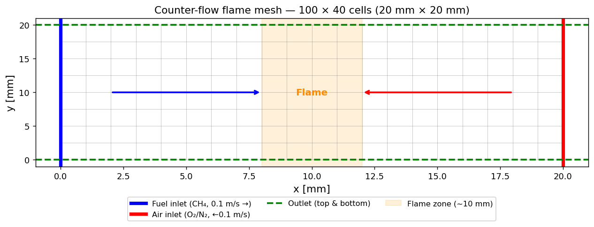
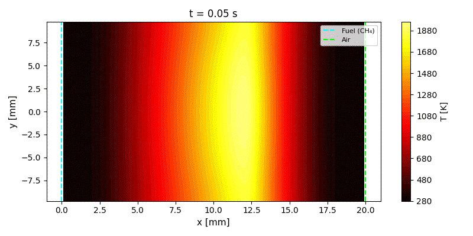
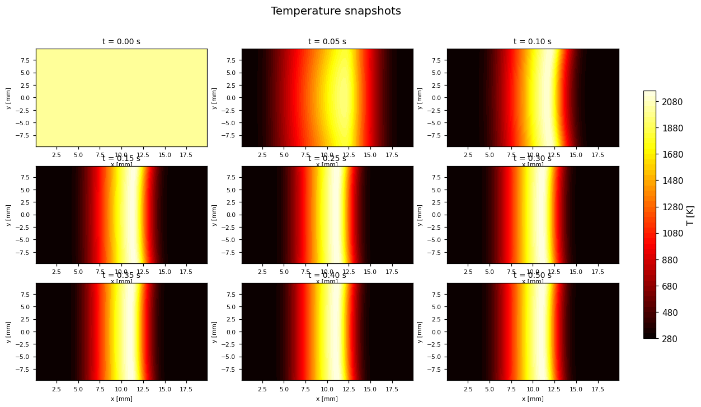
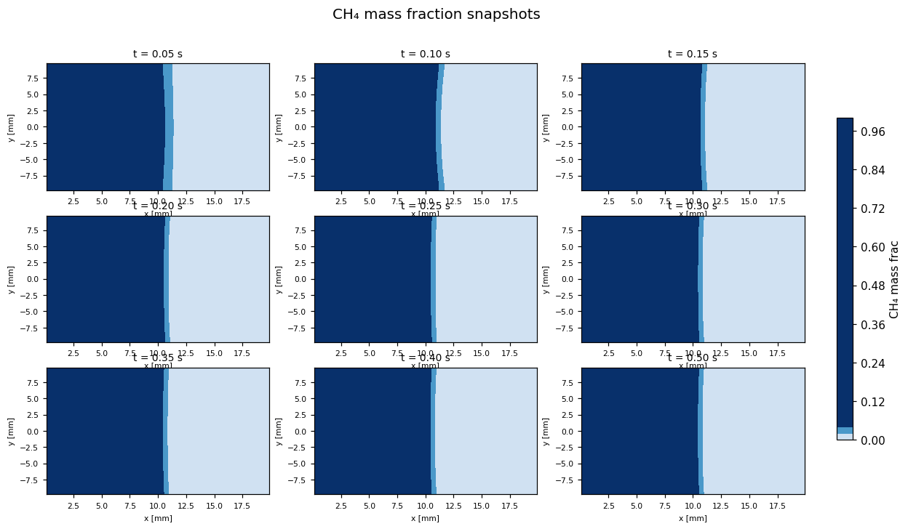
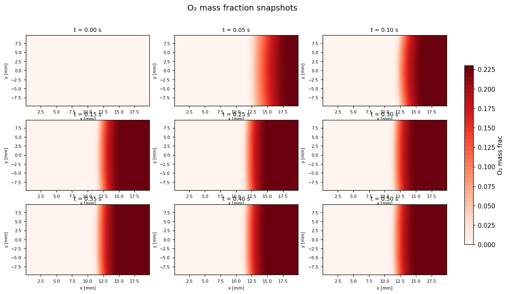
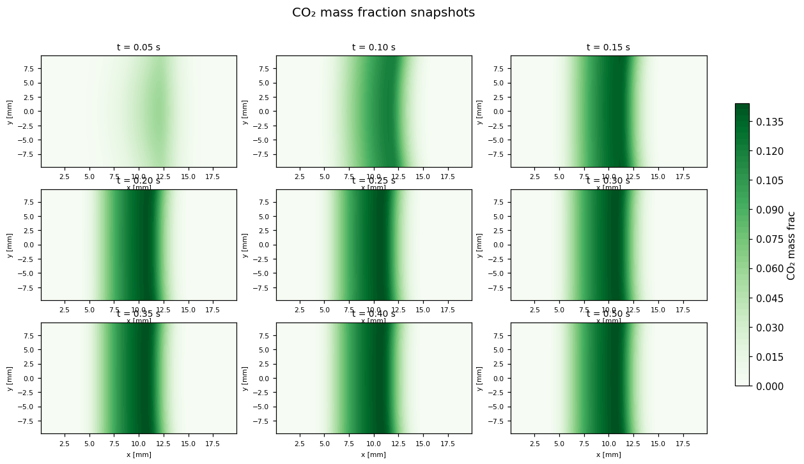
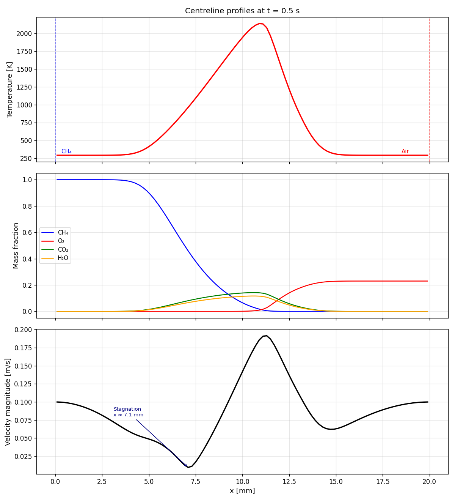
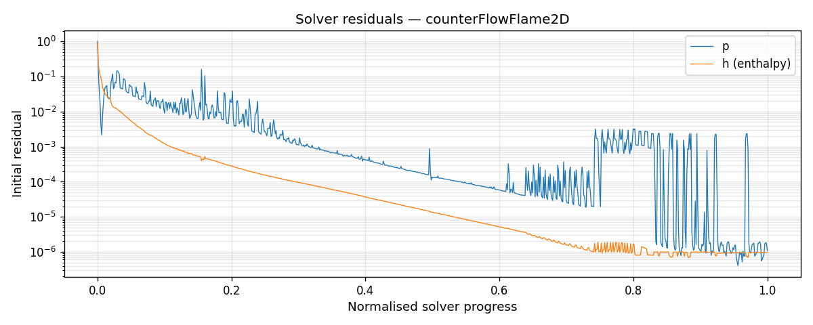

# counterFlowFlame2D — OpenFOAM 13 Laminar Methane Counter-Flow Diffusion Flame

Simulation of a laminar opposed-jet diffusion flame: methane (CH₄) and air streams
flow toward each other, meet at a stagnation plane, and react in a thin diffusion
flame. This is a canonical configuration for studying laminar flame structure,
extinction, and chemistry–diffusion coupling.

---

## Physical Setup

| Parameter | Value |
|---|---|
| Gap width | 20 mm |
| Fuel stream | Pure CH₄ at 0.1 m/s (→) |
| Oxidiser stream | Air (O₂/N₂) at 0.1 m/s (←) |
| Inlet temperature | 300 K (both streams) |
| Pressure | 1 atm |
| Strain rate (a = 2U/L) | 10 s⁻¹ |
| Flame type | Non-premixed diffusion flame |

The two streams collide at a stagnation plane near the mid-gap. Fuel diffuses toward
the oxidiser side and oxygen diffuses toward the fuel side; reaction occurs where the
mixture fraction crosses stoichiometry.

---

## Mesh

| Parameter | Value |
|---|---|
| Cells | 100 × 40 = 4,000 |
| Cell type | Hexahedral (2D, 1 cell deep) |
| Domain | 20 mm × 20 mm |
| Resolution | 0.2 mm × 0.5 mm per cell |
| Fuel inlet | Left face (x = 0) |
| Air inlet | Right face (x = 20 mm) |
| Outlets | Top and bottom faces |

**Mesh layout and flow configuration:**


---

## Chemistry

| Setting | Value |
|---|---|
| Mechanism | Single-step irreversible Arrhenius |
| Reaction | CH₄ + 2 O₂ → CO₂ + 2 H₂O |
| Pre-exponential A | 5.2×10¹⁶ |
| Temperature exponent β | 0 |
| Activation temperature Ta | 14,906 K (Ea ≈ 124 kJ/mol) |
| Species | CH₄, O₂, CO₂, H₂O, N₂ |

The mechanism was developed by Bui-Pham (1992) specifically for this counter-flow
configuration. The Euler-implicit chemistry solver is used with a Rosenbrock stiff ODE
integrator to handle the stiff reaction source terms.

---

## Solver Setup

| Setting | Value |
|---|---|
| Solver | `multicomponentFluid` |
| Combustion model | PaSR (Partially Stirred Reactor) |
| Turbulence | Laminar |
| Thermodynamics | JANAF polynomials |
| Time step | Adaptive, max Co = 0.4 |
| End time | 0.5 s |
| Write interval | 0.05 s |

The flame reaches steady state within ~0.1 s. The remaining 0.4 s confirms
the solution is stationary.

---

## Results

### Flame Structure

The flame establishes rapidly and remains stationary — this is a steady laminar
diffusion flame. The stagnation point sits at approximately x = 7.5 mm (fuel-side
of mid-gap), with the flame zone displaced toward the air side at x ≈ 11 mm due to
the stoichiometry of methane combustion requiring more oxygen by mass.

**Temperature evolution (flame establishment):**


**Temperature snapshots:**


**CH₄ mass fraction snapshots:**


**O₂ mass fraction snapshots:**


**CO₂ mass fraction snapshots:**


### Centreline Profiles

**Temperature, species, and velocity along the centreline at t = 0.5 s:**


Key features visible in the centreline plots:

- **Temperature**: Peak ~2,100 K at x ≈ 11 mm. The asymmetric profile reflects the
  displaced flame position — the fuel-side gradient is steeper because CH₄ diffuses
  into a region already preheated by conduction from the flame. Two reference lines are
  overlaid: the **adiabatic flame temperature** (T_ad = 2,223 K, dashed orange) and the
  **measured range** from published CH₄/air counterflow experiments (1,800–2,050 K, green
  band), which is lower due to radiative heat loss and dissociation of CO₂/H₂O at high
  temperature. Our single-step result sits between the two — above the measured range
  because the mechanism has no dissociation or radiation, but below T_ad because
  incomplete mixing limits the peak. The dotted purple line marks the predicted flame
  position from stoichiometry (Z_st = 0.055 for CH₄/air), confirming the flame correctly
  sits displaced toward the air side.
- **Species**: CH₄ and O₂ are mutually exclusive — they are fully consumed before
  reaching each other's inlet. CO₂ and H₂O peak sharply at the flame zone. The
  single-step mechanism produces no CO or H₂ intermediates, which real flames carry
  through the reaction zone before oxidising to final products.
- **Velocity**: The two opposing streams decelerate to zero at the stagnation point
  (~x = 7.5 mm), with a velocity overshoot at the flame caused by thermal expansion
  of the hot gas.

### Single-Step Mechanism Limitations

The irreversible single-step Arrhenius mechanism captures the gross flame structure
(position, temperature peak, species crossing) but has known limitations compared to
detailed chemistry:

| Property | Single-step result | Detailed chemistry / experiment |
|---|---|---|
| Peak temperature | ~2,100 K | ~1,800–2,050 K |
| CO intermediate | Not present | Significant near flame |
| H₂ intermediate | Not present | Present on fuel side |
| Flame thickness | Thinner | Broader (multi-step kinetics) |
| Extinction strain rate | Over-predicted | Accurately captured |

### Convergence

**Solver residuals:**


Residuals drop sharply as the flame establishes within the first 0.1 s and remain
at machine-precision levels for the remainder of the run, confirming a fully
converged steady flame.

---

## References

Bui-Pham, M. N. (1992). *Studies in structures of laminar hydrocarbon flames.*
PhD Thesis, University of California, San Diego.

Smooke, M. D., Puri, I. K., & Seshadri, K. (1988). A comparison between numerical
calculations and experimental measurements of the structure of a counterflow diffusion
flame burning diluted methane in diluted air. *21st Symposium (International) on
Combustion*, 1783–1792.

Adiabatic flame temperature and stoichiometric mixture fraction (Z_st = 0.055) computed
from thermodynamic equilibrium for undiluted CH₄/air at 1 atm.

---

## Running the Case

```bash
source /opt/openfoam13/etc/bashrc
cd openfoam-counterFlowFlame2D
blockMesh
foamRun
```
